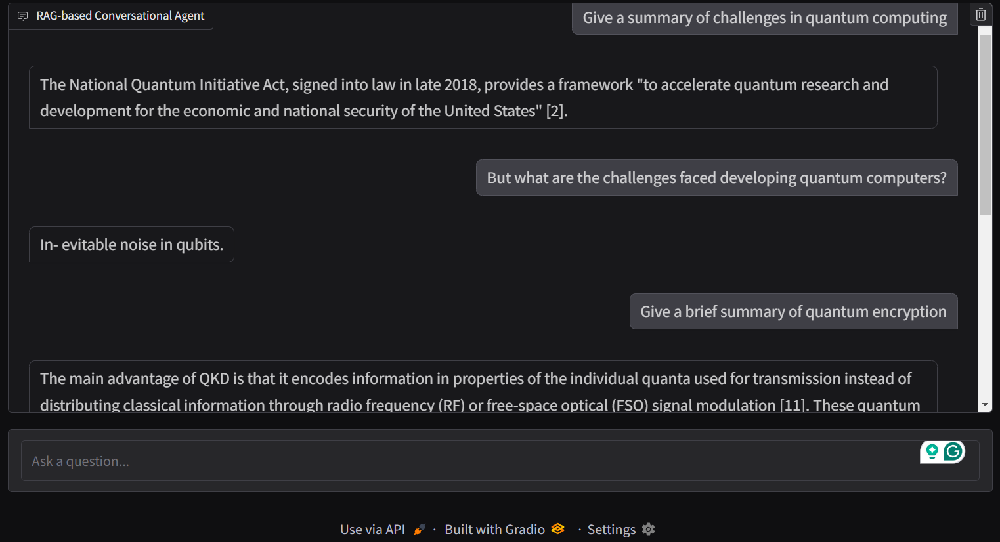

# RAG-LLM Agent

## Summary
Leveraging LangChain and Hugging Face Transformers, this project implements a Retrieval-Augmented-Generation (RAG) system designed to optimize LLM-generated responses. The system aims to create an intelligent agent capable of multi-turn conversations with integrated memory for enhanced context retention.

#### -- Project Status: [Complete]
- Results for various stages of running can be found ``reports/outputs/``

---

## Project Objective
 - Supplement learning through project-based experience while completing NVIDIA's ``Building RAG Agents with LLMs`` course.
 - Improve proficiency with LangChain and modern methods of document retrieval, embedding, and augmentation.
 - Utilise a Retrieval-Augmented-Generation (RAG) pipeline to enhance knowledge of generative AI and its practical applications.
 - Build a modular architecture that allows easy integration and replacement of LLMs, including more advanced models like OpenAI’s ChatGPT or other future offerings.

## Technologies

* Python 3.12.8
* LangChian
* HuggingFace transformers
* FAISS Vectorstore
* Gradio

### Raw Data
- Research papers, both local .pdf files and requested from Arxiv via API
- https://arxiv.org/abs/2501.08476 (citation - arXiv:2501.08476 [quant-ph])
- https://arxiv.org/abs/2501.09079 (citation - arXiv:2501.09079 [quant-ph])

## Methodologies

- **Document Retrieval and Augmentation:** Built retrieval systems using FAISS to identify and retrieve relevant document chunks, leveraging their context for response generation. Augmented the retrieved data with additional metadata for improved query results.
- **Conversational Memory:** Integrated memory-based retrieval pipelines using LangChain's ConversationalRetrievalChain and ConversationBufferMemory to maintain multi-turn conversational context.
- **LLM Integration:** Utilised Hugging Face Transformers for text generation, deploying a local model pipeline to ensure efficient and contextually accurate responses.
- **Pipeline Modularity:** Designed a modular RAG pipeline architecture with separate components for retrieval, response generation, and user interaction, ensuring scalability and maintainability.
- **User Interaction:** Developed a Gradio-based conversational dashboard for real-time interactions with the RAG pipeline, enabling seamless multi-turn conversations with source document attribution.
- **Data Handling:** Implemented a robust data handling system using LangChain's utilities and custom DataModule classes for managing vector stores, retrieval pipelines, and conversational chains.

---

## Run this Project
- ``git clone`` the repo and ``cd`` into the directory
- Create virtual environment and install dependencies ``pip install -r requirements.txt``
- Run the pipeline ``python main.py``
- Launch localgradio interface to view conversational dashboard

---

## References
Utilised soley as a source of raw data, for testing/demonstrative purposes.
- arXiv:2501.08476 [quant-ph]
- arXiv:2501.09079 [quant-ph]

---

## Contacts

For more information, or to discuss this project further, please reach out.

Email: delstonds@outlook.com
